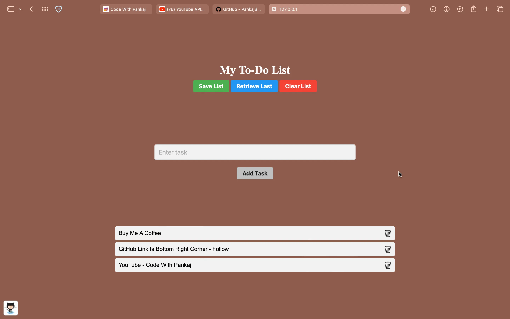

# TODO List App

This is a simple to-do list application built using HTML, CSS, and JavaScript. The application allows users to add tasks to a list, remove tasks from the list, and store/retrieve the list using local storage.

<hr>

💙 Join the channel to see more videos like this. [Code_With_Pankaj](https://www.youtube.com/c/CodeWithPankaj1?sub_confirmation=1)
<hr>

<div align=center>

## Must visit 👇 (Click on it)

[](https://www.youtube.com/c/CodeWithPankaj1?sub_confirmation=1)

</div>

<hr>

## Features

- A responsive design.
- Add new tasks to the list by entering text in the input box and pressing enter
- Remove tasks from the list by clicking the "Delete" button next to the task
- Store the current list in local storage by clicking the "Store List" button
- Retrieve the saved list from local storage by clicking the "Retrieve List" button
- The width of the project will be automatically fixed.

# Usage
To use the application, simply open the index.html file in your web browser. You can add tasks to the list by entering text in the input box and pressing enter, or by clicking the "Add Task" button. You can remove tasks from the list by clicking the "Delete" button next to the task. You can store the current list in local storage by clicking the "Store List" button, and retrieve the saved list from local storage by clicking the "Retrieve List" button.

## Authors

- [@pankajbaliyan](https://www.github.com/pankajbaliyan)


## Contributing

Contributions are always welcome!

See `index.html` for ways to get started.

Please adhere to this project's `code of conduct`.


## Demo

https://todo-list-cwp.vercel.app
<br><br>
https://pankajbaliyan.github.io/TODO-List/

## Feedback

If you have any feedback, please reach out to us at pankajbaliyan90@gmail.com


## 🔗 Links
<div style="display:flex; justify-content: space-between">

[](https://www.linkedin.com/in/pankaj-kumar-90/)

[](https://codewithpankaj.vercel.app)

</div>

## Lessons Learned

HTML, CSS, and JavaScript basics: This project provides a good introduction to the basics of HTML, CSS, and JavaScript. You'll learn how to structure a web page, style it using CSS, and add interactivity using JavaScript.

DOM manipulation: The project involves dynamically adding and removing HTML elements to the page, which requires a good understanding of the Document Object Model (DOM) and how to manipulate it using JavaScript.

Local storage: The project demonstrates how to use local storage in JavaScript to store and retrieve data from the browser. This is a useful feature for web applications that need to persist data between sessions.

Event handling: The project relies heavily on event handling to detect user actions and trigger functions in response. You'll learn how to handle events such as button clicks, key presses, and DOM mutations.

Debugging: As with any programming project, debugging is an important skill to develop. You'll likely encounter bugs and errors while working on this project, and learning how to diagnose and fix them will be valuable for future projects.
## Run Locally

Clone the project

```bash
  git clone https://github.com/PankajBaliyan/TODO-List.git
```

Go to the project directory

```bash
  cd TODO-List
```

Start code editor

```bash
  code .
```


## Screenshots




## Support

For support, email pankajbaliyan90@gmail.com or join our Slack channel.